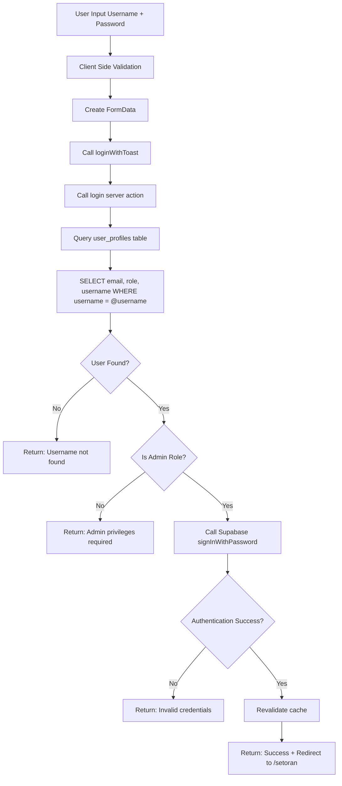

# 🔐 Admin Login Validation System

## 📋 Overview
Sistem login telah diupdate dengan validasi role admin. Sekarang hanya user dengan role "admin" yang dapat login ke aplikasi ini.

## 🔧 Perubahan yang Dilakukan

### 1. **Login Server Action (`/src/utils/Auth/login.ts`)**

#### Sebelum:
```typescript
// Hanya mengecek username dan email
const { data: userData, error: userError } = await supabase.rpc(
  "check_username_exists",
  { username: `@${username.toLowerCase()}` }
);
```

#### Sesudah:
```typescript
// Mengecek username, email, DAN role sekaligus
const { data: userData, error: userError } = await supabase
  .from("user_profiles")
  .select("email, role, username")
  .eq("username", `@${username.toLowerCase()}`)
  .single();

// Validasi role admin - hanya admin yang boleh login
if (!userData.role || userData.role.toLowerCase() !== "admin") {
  return {
    success: false,
    error: "Access denied: Admin privileges required",
  };
}
```

### 2. **Client-side Error Handling (`/src/utils/Auth/auth-client.ts`)**

```typescript
// Menambahkan mapping untuk error admin privileges
if (res.error?.includes("Admin privileges required")) {
  errorMessage = res.error; // Menggunakan message dari server
}
```

### 3. **Internationalization (Dictionary Files)**

**English (`/src/dictionaries/common/en.json`):**
```json
{
  "auth": {
    "admin_access_required": "Access denied: Admin privileges required"
  }
}
```

**Indonesian (`/src/dictionaries/common/id.json`):**
```json
{
  "auth": {
    "admin_access_required": "Akses ditolak: Diperlukan hak akses admin"
  }
}
```

## 🚀 Flow Sistem Baru



## 🔍 Validasi Role Admin

### Kondisi yang Dicek:
1. ✅ User ditemukan di database
2. ✅ User memiliki field `role` yang tidak null/kosong
3. ✅ Field `role` bernilai "admin" (case-insensitive)

### Jenis User yang BISA Login:
- ✅ `role: "admin"`
- ✅ `role: "Admin"`  
- ✅ `role: "ADMIN"`

### Jenis User yang TIDAK BISA Login:
- ❌ `role: null`
- ❌ `role: ""`
- ❌ `role: "user"`
- ❌ `role: "member"`
- ❌ `role: "moderator"`
- ❌ User tidak ditemukan

## 🧪 Testing Scenarios

### Test Case 1: Admin Berhasil Login
```
Input: username="admin_user", password="correct_password"
Database: role="admin", email="admin@example.com"
Expected: ✅ Login berhasil, redirect ke /setoran
```

### Test Case 2: User Biasa Ditolak
```
Input: username="regular_user", password="correct_password"
Database: role="user", email="user@example.com"
Expected: ❌ Error: "Access denied: Admin privileges required"
```

### Test Case 3: User Tanpa Role Ditolak
```
Input: username="no_role_user", password="correct_password"
Database: role=null, email="norole@example.com"
Expected: ❌ Error: "Access denied: Admin privileges required"
```

### Test Case 4: Username Tidak Ditemukan
```
Input: username="nonexistent", password="any_password"
Database: User tidak ada
Expected: ❌ Error: "Username not found"
```

## 🔧 Setup Database

### Struktur Tabel `user_profiles`:
```sql
-- Pastikan kolom role ada dan diset untuk admin users
UPDATE user_profiles 
SET role = 'admin' 
WHERE username = '@admin_username';

-- Cek user mana saja yang bisa login sebagai admin
SELECT username, email, role 
FROM user_profiles 
WHERE LOWER(role) = 'admin';
```

## 🚨 Security Notes

1. **Role Validation**: Hanya user dengan role "admin" yang bisa login
2. **Case Insensitive**: Role check menggunakan `.toLowerCase()` untuk fleksibilitas
3. **Error Messages**: Pesan error yang jelas untuk debugging dan user experience
4. **Database Security**: Menggunakan Supabase RLS dan proper query validation

## 🐛 Troubleshooting

### Issue: "Username not found"
- ✅ Cek apakah username tersimpan dengan format `@username` di database
- ✅ Pastikan username menggunakan lowercase

### Issue: "Admin privileges required"  
- ✅ Cek kolom `role` di tabel `user_profiles`
- ✅ Pastikan role diset ke "admin"
- ✅ Pastikan role tidak null atau kosong

### Issue: "Invalid credentials"
- ✅ Cek password user di Supabase Authentication
- ✅ Pastikan email di `user_profiles` match dengan email di `auth.users`

## 📞 Implementation Support

Untuk testing atau debugging, gunakan query berikut:

```sql
-- Cek user dan role
SELECT username, email, role, created
FROM user_profiles 
WHERE username = '@your_username';

-- Set user sebagai admin
UPDATE user_profiles 
SET role = 'admin' 
WHERE username = '@your_username';
```
