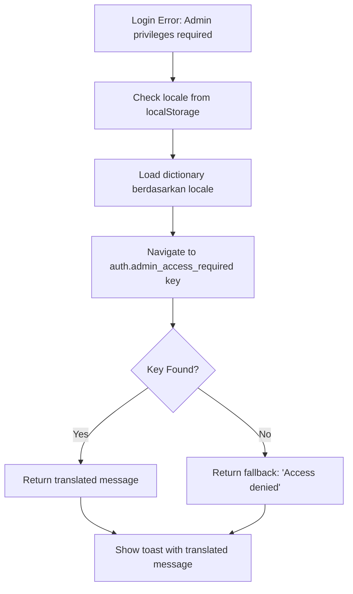

# 🌐 Admin Toast Internationalization

## 📋 Overview
Toast error untuk admin access sekarang sudah menggunakan dictionary sistem internationalization. Pesan error akan ditampilkan sesuai bahasa yang dipilih user (English/Indonesian).

## 🔧 Perubahan yang Dilakukan

### 1. **Helper Function untuk Translation di luar React Context**

Ditambahkan helper function `getTranslatedMessage` di `auth-client.ts`:

```typescript
async function getTranslatedMessage(key: string, fallback: string): Promise<string> {
  try {
    const locale = getStoredLocale();
    const dictionary = await getDictionaries(['common'], locale);
    
    // Navigate through nested object (e.g., "auth.admin_access_required")
    const keys = key.split('.');
    let value: any = dictionary;
    
    for (const k of keys) {
      value = value?.[k];
      if (value === undefined) break;
    }
    
    return typeof value === 'string' ? value : fallback;
  } catch (error) {
    console.error('Error getting translated message:', error);
    return fallback;
  }
}
```

### 2. **Update LoginWithToast Function**

```typescript
export async function loginWithToast(formData: FormData) {
  const res = await login(formData);
  if (res.success) {
    toast.success("Login successful! Redirecting to dashboard...");
  } else {
    // Map specific error messages untuk internationalization
    let errorMessage = res.error;
    
    // Khusus untuk error admin access, gunakan dictionary
    if (res.error?.includes("Admin privileges required")) {
      errorMessage = await getTranslatedMessage("auth.admin_access_required", "Access denied");
    }
    
    toast.error(errorMessage);
  }
  return res;
}
```

### 3. **Dictionary Definitions**

**English (`/src/dictionaries/common/en.json`):**
```json
{
  "auth": {
    "admin_access_required": "Access denied"
  }
}
```

**Indonesian (`/src/dictionaries/common/id.json`):**
```json
{
  "auth": {
    "admin_access_required": "Akses ditolak"
  }
}
```

## 🚀 Cara Kerja

### **Flow Internationalization:**



### **Hasil Error Toast berdasarkan Bahasa:**

#### **🇺🇸 English (locale: 'en'):**
```
❌ Access denied
```

#### **🇮🇩 Indonesian (locale: 'id'):**
```
❌ Akses ditolak
```

## 🔍 **Testing Scenarios**

### **Test Case 1: User Indonesia dengan role non-admin**
```
Input: username="regular_user", password="correct_password"
Database: role="user"
Locale: "id"
Expected Toast: ❌ "Akses ditolak"
```

### **Test Case 2: User English dengan role null**
```
Input: username="norole_user", password="correct_password"
Database: role=null
Locale: "en"
Expected Toast: ❌ "Access denied"
```

### **Test Case 3: Fallback ketika dictionary error**
```
Input: username="member_user", password="correct_password"
Database: role="member"
Scenario: Dictionary gagal load
Expected Toast: ❌ "Access denied" (fallback)
```

## 🛠️ **Technical Details**

### **Key Features:**
1. ✅ **Async Translation**: Menggunakan `await getTranslatedMessage()`
2. ✅ **Fallback Support**: Jika translation gagal, gunakan fallback message
3. ✅ **Nested Key Support**: Mendukung key seperti `"auth.admin_access_required"`
4. ✅ **Error Handling**: Graceful fallback jika ada error loading dictionary
5. ✅ **Cache Optimization**: Dictionary sudah di-cache oleh sistem i18n

### **Dependencies:**
- ✅ `getDictionaries` dari `@/lib/i18n`
- ✅ `getStoredLocale` dari `@/lib/i18n`
- ✅ Dictionary files di `/src/dictionaries/common/`

## 🔧 **Extending Translation**

Untuk menambah error messages lain yang perlu internationalization:

```typescript
// Contoh menambah error message lain
if (res.error?.includes("Username not found")) {
  errorMessage = await getTranslatedMessage("auth.username_not_found", "Username not found");
} else if (res.error?.includes("Invalid credentials")) {
  errorMessage = await getTranslatedMessage("auth.invalid_credentials", "Invalid username or password");
}
```

Dan tambahkan key yang sesuai di dictionary files:

```json
{
  "auth": {
    "admin_access_required": "Access denied",
    "username_not_found": "Username not found",
    "invalid_credentials": "Invalid username or password"
  }
}
```

## 🎯 **Results**

✅ **Toast error admin access sekarang fully internationalized**
✅ **Mendukung English dan Indonesian**
✅ **Graceful fallback jika translation gagal**
✅ **Reusable helper function untuk error messages lain**
✅ **Performance optimal dengan dictionary caching**

Admin yang mencoba login dengan role non-admin akan melihat pesan error dalam bahasa yang sesuai dengan preference mereka!
